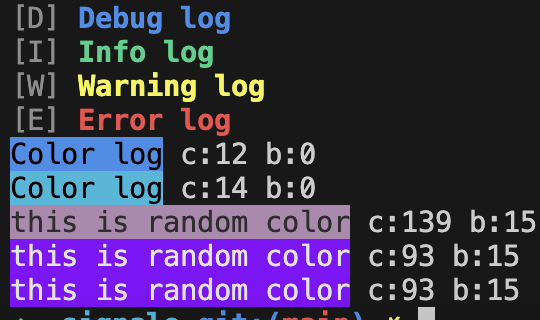
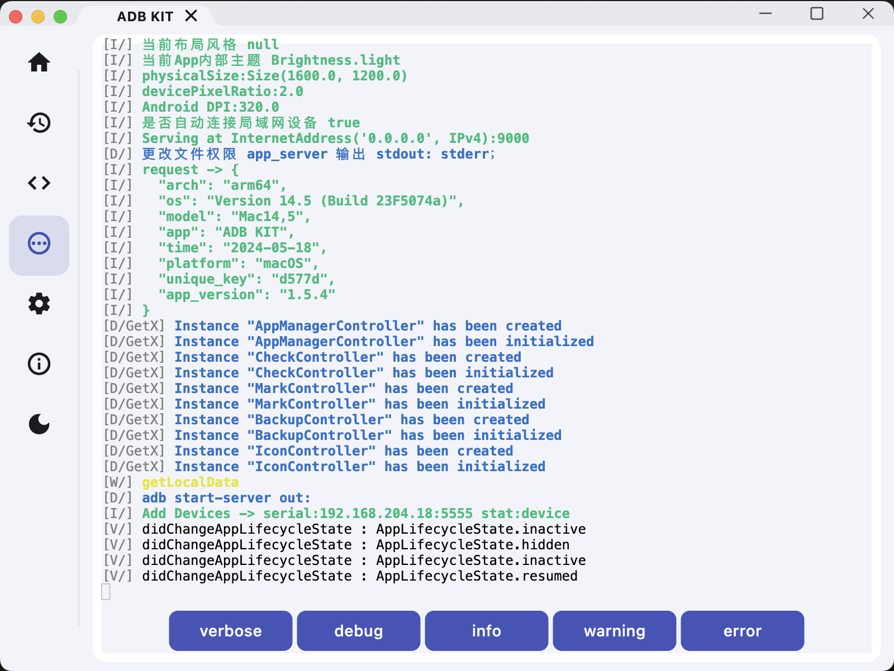

# signale
signale is a simple log package for dart with pure code, inspire from signale.js.

I want a simple log package, and can support color text,no complicated design.

and can get log data, because I want display log data in my app.

## Screenshot
display on Terminal


you can see from this code
```dart
void main() {
  Log.defaultLogger.level = LogLevel.info;
  Log.d('Debug log');
  Log.i('Info log');
  Log.w('Warning log');
  Log.e('Error log');
  Log.v('Verbose log');
  Log.c('Color log', 12);
  Log.c('Color log', 14);
  Log.r('this is random color');
  Log.r('this is random color');
  Log.r('this is random color');
}

```

display on Flutter Widget with xterm.dart


## Get Started

### support function
```dart
Log.w
Log.e
Log.i
Log.v
Log.d
Log.custom
Log.r
```

### Set log level
```dart
Log.defaultLogger.level = LogLevel.info;
```

### Listen Log Data

you can listen log stream

```dart
Log.defaultLogger.stream.listen((event) {
  print(event);
});
```

### Replace Default Logger
1. implement `Printer` class
```dart
abstract class Printable {
  void print(DateTime time, Object object);
}
```

2. set `Printer` to `Log.defaultLogger.printer`
```dart
 Log.defaultLogger.printer = Printer();
```

